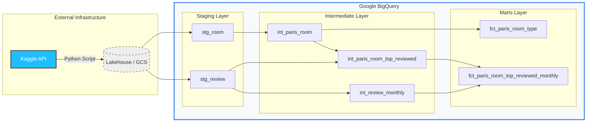
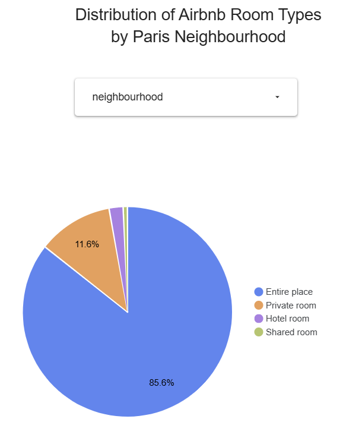
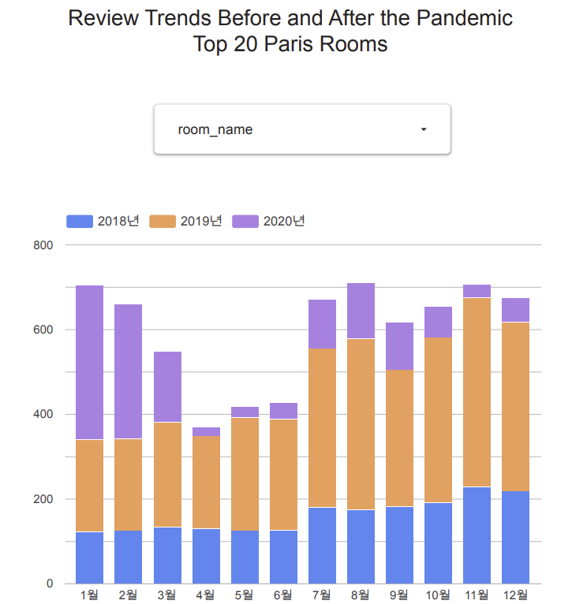

# paris-airbnb-de-zoomcamp

## Description
This project is part of the [Data Engineering Zoomcamp](https://github.com/DataTalksClub/data-engineering-zoomcamp), focusing on building an end-to-end data pipeline to analyze Airbnb room and review data of Paris.

🔗Live Dashboard: [View Interactive Report on Looker Studio](https://lookerstudio.google.com/reporting/07d24862-8208-40db-a2fd-9176d311c94b/page/tEnnC)

## Data Pipeline
#### 🕒 Automation & Scheduling
The pipeline is "Automation-Ready." Currently, it is set to run manually (on-demand) to manage resources, but it is fully compatible with scheduled execution.
### Data Source
[Kaggle - Airbnb Listings & Reviews](https://www.kaggle.com/datasets/mysarahmadbhat/airbnb-listings-reviews)

### Data Flow

#### 🚀 Data Pipeline Workflow
1. Extract: Utilizing the Kaggle API, raw datasets are programmatically downloaded into the local data/Airbnb Data directory to ensure data reproducibility.

2. Load: The local CSV files are uploaded to the Google Cloud Storage (GCS) /raw path using a custom ingest.py Python script, serving as the project's data lake.

3. Transform: Data is processed within BigQuery through a structured dbt (Data Build Tool) pipeline. To adhere to industry-standard data modeling principles, the transformation is divided into four distinct layers:

> 📁 **Raw**: Initial landing zone for source data.
> 
> 🧹**Staging**: Cleaning, casting, and renaming raw fields.
> 
> ⚙️**Intermediate**: Complex joining and business logic application (e.g., filtering Paris-specific data).
>
> 📊**Marts**: Finalized, analytics-ready fact and dimension tables.
> 
> Note: This modular approach ensures data integrity and follows dbt best practices for scalable modeling.
>
> Note: You can also check resource details and naming convention in [this section](#1-resource-details).

4. Visualize: The refined data from the Marts layer is connected to Looker Studio to create an interactive dashboard, providing insights into room type distributions and pandemic-related review trends.

### Technologies
- Cloud: `GCP(Google Cloud Platform)`
- Infrastructure as code (IaC): `Terraform`
- CI/CD & Automation: [`Github Actions`](#3-why-github-actions-for-automation)
- Data Warehouse: `BigQuery`
- Data Transformation: `dbt`
- Vibe Coding: `cline` + `Gemini 2.5 Pro`

## Visualizations & Analytics
The objective of this analysis is to provide insights into the local accommodation market and the impact of global events on tourism through the following visualizations:

<!-- <table width="100%">
<h3>📈 1. Distribution of Room Types by Neighbourhood</h3>
  <tr>
    <td width="50%" align="center" valign="top">
      
      <small><em>Distribution of Airbnb Room Types
by Paris Neighbourhood</em></small>
    </td>
    <td width="50%" valign="top">
      <p><strong>Format:</strong> <code>Interactive Pie Chart</code></p>
      <hr>
      <strong>📝 Description</strong>
      <p>This chart visualizes the proportion of Airbnb accommodation types across Paris districts. Users can dynamically switch between areas like <strong>Opera</strong> and <strong>Passy</strong> using the dropdown filter.</p>
      <br>
      <strong>💡 Key Insight</strong>
      <p>Reveals unique market characteristics, highlighting whether an area is dominated by tourist-centric apartments or transit-oriented budget rooms.</p>
    </td>
  </tr>
</table> -->
<table width="100%">
  <tr>
    <td colspan="2"><h3>📈 1. Distribution of Room Types by Neighbourhood</h3></td>
  </tr>
  <tr>
    <td width="50%" align="center" valign="top">
      
      <br>
      <small><em>Distribution of Airbnb Room Types by Paris Neighbourhood</em></small>
    </td>
    <td width="50%" valign="top">
      <p><strong>Format:</strong> <code>Interactive Pie Chart</code></p>
      <hr>
      <strong>📝 Description</strong>
      <p>This chart visualizes the proportion of Airbnb accommodation types across Paris districts. Users can dynamically switch between areas like <strong>Opera</strong> and <strong>Passy</strong> using the dropdown filter.</p>
      <br>
      <strong>💡 Key Insight</strong>
      <p>Reveals unique market characteristics, highlighting whether an area is dominated by tourist-centric apartments or transit-oriented budget rooms.</p>
    </td>
  </tr>
</table>

<br>

<!-- <table width="100%">
<h3>📈 2. Comparative Monthly Review Trends</h3>
<tr>
<td width="50%" align="center" valign="top">



<small><em>Review Trends Before and After the Pandemic Top 20 Paris Rooms</em></small>
</td>
<td width="50%" valign="top">

<p><strong>Format:</strong> <code>Stacked Bar Chart (Time-series)</code></p>
<hr>
<strong>📝 Description</strong>
<p>This visualization tracks the monthly review registration trends for the <strong>Top 20 most-reviewed Paris listings</strong>. By stacking yearly data (2018 vs. 2019 vs. 2020) along the X-axis (Months), the chart provides a direct comparison of seasonal activity and year-over-year growth.</p>


<strong>💡 Data Insight: Pandemic Impact</strong>
<p>The chart vividly illustrates the <strong>sharp decline in travel activity starting in March 2020</strong>. While 2019 showed robust seasonal growth, the 2020 data highlights the significant disruption caused by the global pandemic, with review volumes failing to recover to pre-pandemic levels.</p>

</td>
</tr>
</table> -->
<h3>📈 2. Comparative Monthly Review Trends</h3>
<table width="100%">
  <tr>
    <td width="50%" align="center" valign="top">
      
      <br>
      <small><em>Review Trends Before and After the Pandemic: Top 20 Paris Rooms</em></small>
    </td>
    <td width="50%" valign="top">
      <p><strong>Format:</strong> <code>Stacked Bar Chart (Time-series)</code></p>
      <hr>
      <strong>📝 Description</strong>
      <p>This visualization tracks the monthly review registration trends for the <strong>Top 20 most-reviewed Paris listings</strong>. By stacking yearly data (2018 vs. 2019 vs. 2020) along the X-axis (Months), the chart provides a direct comparison of seasonal activity and year-over-year growth.</p>
      <br>
      <strong>💡 Data Insight: Pandemic Impact</strong>
      <p>The chart vividly illustrates the <strong>sharp decline in travel activity starting in March 2020</strong>. While 2019 showed robust seasonal growth, the 2020 data highlights the significant disruption caused by the global pandemic.</p>
    </td>
  </tr>
</table>

## How to Run

### Prerequisites
1. Kaggle key file
2. gcp key file

### Run in Github Actions
1. Fork the Repository

2. Configure GitHub Secrets

To authenticate with Google Cloud and Kaggle, you must register the following secrets. Go to Settings > Secrets and Variables > Actions and add these:

   | Secret Name | Description |
   | :--- | :--- |
   | **GCP_PROJECT_ID** | `Your Google Cloud Project ID` |
   | **GCP_SA_KEY** | `The JSON key of your Google Service Account (with BigQuery/GCS permissions)` |
   | **KAGGLE_USERNAME** | `Your Kaggle username (found in kaggle.json)` |
   | **KAGGLE_KEY** | `Your Kaggle API token (found in kaggle.json)` |

   ---
<br>


3. Execute the Workflow

4. Verify Results in BigQuery

   Confirm that the bigquery datasets (raw, staging, intermediate, marts) and their respective tables have been created and populated with data.

   💡 Engineering Note for Users
   Note: The pipeline is designed to be idempotent. Running the workflow multiple times will refresh the datasets without creating duplicate schemas, ensuring a consistent state in your BigQuery environment.

### Run in local
1. Clone the Repository

2. Configure Google Cloud Authentication

   To authenticate your Google Cloud environment, set the `GOOGLE_APPLICATION_CREDENTIALS` environment variable to the path of your GCP key file:

   1. Add the environment variable to your `.bashrc` file by running the following command:
      ```bash
      echo 'export GOOGLE_APPLICATION_CREDENTIALS="/path/to/your/gcp-key.json"' >> ~/.bashrc
      echo 'export TF_VAR_project_id="your-gcp-project-id"' >> ~/.bashrc
      echo 'export TF_VAR_gcs_bucket_name="datalake-${TF_VAR_project_id}"' >> ~/.bashrc
      ```
   2. Apply the changes by sourcing your `.bashrc` file:
      ```bash
      source ~/.bashrc
      ```

3. Configure Kaggle Authentication

   Configured your Kaggle API credentials (kaggle.json in ~/.kaggle/).
   ```json
   {"username":"<your_username>","key":"<your_key>"}
   ```


4. Install Python Requirements

   ```bash
   pip install -r requirements.txt
   ```

5. Run Terraform


   ```bash
   terraform -chdir=terraform init
   terraform -chdir=terraform apply
   ```

5. Run Python script to ingest data

   ```bash
   python scripts/ingest.py
   ```

6. Run dbt
   ```bash
   dbt init paris_airbnb_dbt
   dbt deps --project-dir paris_airbnb_dbt
   dbt run-operation stage_external_sources --project-dir paris_airbnb_dbt
   dbt run --project-dir paris_airbnb_dbt
   ```


## Appendix
### 1. Resource Details

| Component | Path / Name |
| :--- | :--- |
| **Local Data Path** | `data/Airbnb Data` |
| **GCP Project ID** | `paris-airbnb-de-zoomcamp` |
| **GCS Bucket Name** | `datalake-paris-airbnb-de-zoomcamp` |
| **GCS Data Path** | `raw` |

---


| BigQuery Dataset | Layer | Description |
| :--- | :--- | :--- |
| raw | `raw` | External tables (Landing Zone) |
| staging | `staging` | Atomic models & basic cleaning |
| intermediate | `intermediate` | Complex joins & business logic |
| marts | `marts` | Analytics-ready Fact/Dimension tables|

---

### 2. Naming Conventions

To ensure global uniqueness and maintainable infrastructure, the following conventions are applied:

> #### 🪣 GCS Bucket Naming Convention
> * **Format:** `datalake-${project_id}`
> * **Description:** We append the `project_id` as a suffix to ensure the GCS bucket name is globally unique.
> * **Result:** `datalake-`**paris-airbnb-de-zoomcamp**

---

### 3. Why GitHub Actions for Automation?

Instead of deploying a heavy workflow orchestration tool (e.g., Airflow or Prefect), I chose **GitHub Actions** to automate the pipeline for the following reasons:

1. **Minimized Complexity**: Since the current pipeline consists of a few well-defined steps, I avoided "over-engineering" the infrastructure to maintain a clean and focused codebase.
2. **Built-in Reproducibility**: The automation logic is stored directly as YAML in the repository, making it transparent and easily reproducible for anyone who forks this project.
3. **Seamless Integration**: Using a CI/CD-based approach allows for an event-driven workflow that triggers on specific code changes or schedules without the need for managing persistent servers.

*My goal was to focus on **reliable data delivery** rather than managing infrastructure overhead.*
